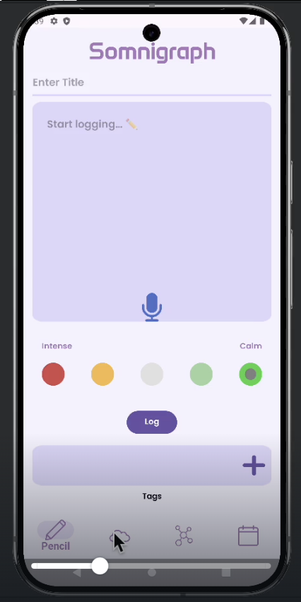

# Somnigraph
This is an android app for Dream Pattern Recognition and Analysis. **View project proposal as well other medias here:**

[Google Drive Link](https://drive.google.com/drive/folders/1AU8ZB3TAmVZ0FRcRuvtXVvETROV2hNe7?usp=sharing)

**Final Presentation Canva Link:**
[Canva Link](https://www.canva.com/design/DAGY3XdqtlI/rrr4u3XvLTp7jKURRd8LZQ/edit?utm_content=DAGY3XdqtlI&utm_campaign=designshare&utm_medium=link2&utm_source=sharebutton)

This project was part of CS465 User Interface at UIUC. App is fully functional with emulator on local servers.  
_Last updated: 1/8/25_

 

## Features Preview (More features are shown in Canva presentation):

  
  
  
  

 

## Members:

Christopher Nee    
Gabriel Righi    
Lina Mei    
Rachel Tin    
Yuktha Sureshkumar    
Yushi Li    
